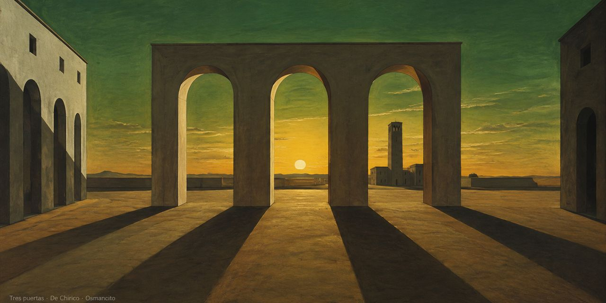

**Lobby** · [Destilería](https://github.com/osmancitov/destileria/blob/main/README.md) · [Taller](https://github.com/osmancitov/taller/blob/main/README.md) · [Journal](https://github.com/osmancitov/journal/blob/main/README.md)

# Osmancito

Esta es la puerta principal de la casa.

Aquí todo es un archivo, y todo archivo es texto. Es la vieja idea de Unix, llevada a una casa: sin adornos, sin maquinaria, solo palabras en un árbol de carpetas que cualquiera puede abrir, copiar o llevarse a otra parte. La casa es humilde y liviana a propósito. Lo que pesa poco viaja lejos, y lo que es texto sobrevive a las modas, a las plataformas y a quien lo escribió. Cada quien trae su lector; la casa solo guarda las páginas. GitHub Pages sirve esos `.md` tal cual: texto plano, sin fábrica ni proceso de build de por medio.

## Las salas

- **Destilería**: reduce los grandes textos a su hueso y los cuenta. Su Bodega guarda los lotes terminados.
- **Taller**: los cuadernos en bruto, donde se estudia, se apuntan vetas y se guardan frases.
- **Journal**: una entrada lírica por día.

## Las imágenes

Cada sala tiene su cuadro, pintado con el protocolo n105 de ilustración (`protocolos/n105_ilustracion.md` en la Destilería) y con un pintor propio. El lienzo mide 1280×640 px y deja un borde de 40 pt alrededor de lo importante.

Lobby, De Chirico. Destilería, Zurbarán. Taller, Joseph Wright de Derby. Journal, Rembrandt.

Una sala nueva recibe su cuadro del mismo modo, con su propio estilo.
